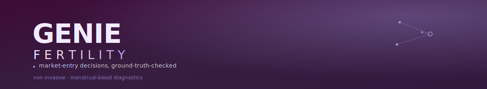

[](https://github.com/ajinkyabhanudas/genie-fertility/actions/workflows/retrieval-state-ui.yml)
[](https://github.com/ajinkyabhanudas/genie-fertility/actions/workflows/secure-backend.yml)
[](tsconfig.json)
[](package.json)
[](package.json)
[](docker-compose.yml)
[](server/db/migrations/001_init.sql)
[](DECISIONS.md)

An AI-driven market-entry consulting tool for Genie Fertility (menstrual-blood
diagnostics). Given a region and a clinical adjacency (e.g. endometriosis,
RIF), it produces a market-entry decision — regulatory analysis, market
sizing, competitive landscape, financial model — grounded in retrieved
clinical/regulatory sources, not model guesswork.

**Status:** early build. See [Status](#status) below and
[DECISIONS.md](DECISIONS.md) for the live phase tracker.

---

## What it does (today)

- Ten-step "Market Playbook" pipeline (regulatory analysis → market sizing →
  financial model → strategic verdict) driven by Gemini generation grounded
  in retrieved sources.
- Hybrid retrieval (BM25 + cosine similarity + RRF) over Europe PMC,
  ClinicalTrials.gov, openFDA, and a static corpus.
- **Honest retrieval state** — the UI shows `grounded` / `degraded` /
  `data-gap` derived from real signals (embedding mode, source-fetch
  success, similarity threshold). No fabricated confidence scores.
- **Secure backend proxy** — Gemini API key lives server-side behind an
  Express proxy with fail-closed auth, a hash-chained audit log, and
  Postgres+pgvector persistence. No key ships in the client bundle
  (enforced by a CI grep gate).

## What it does NOT do yet

- Live provenance resolution (a cited PMID/DOI/NCT is checked for *format*
  only, not confirmed to exist against a live registry) — deferred, see
  DECISIONS.md #1.
- True BM25 or a persistent vector index — retrieval logic is still
  client-side with a per-query recompute (SP-3's job).
- Any eval harness, ground-truth gate, or faithfulness scoring — every
  AI/RAG claim currently ships without a measurable eval (SP-5, the
  project's centrepiece phase, hasn't started).
- Company-provided baseline ingestion — `financials.ts` still hardcodes
  numbers with no provenance (SP-4 hasn't started).
- Real sub-agent architecture — the 10 playbook steps are still blind
  single-shot prompts, no planner/verifier (SP-6 hasn't started).

---

## Requirements

- Node.js 20+
- A Gemini API key (optional — the app runs in degraded/fallback mode
  without one; embeddings fall back to a deterministic vectorizer)
- Docker (for the local Postgres+pgvector backend)

---

## Setup

```bash
cp .env.example .env   # fill in GEMINI_API_KEY, AUTH_TOKEN, DATABASE_URL
docker compose up -d   # starts Postgres+pgvector, runs the migration automatically
npm install
npm run dev:server     # starts the Express proxy on :8787
npm run dev            # in a second terminal — starts Vite on :3000, proxies /api to :8787
```

Open **http://localhost:3000**.

To verify the key never reaches the client bundle:

```bash
npm run build
grep -rE "GEMINI_API_KEY|AIza[0-9A-Za-z_-]{35}" dist/assets/*.js   # should print nothing
```

---

## Developer commands

| Command | What it does |
|---|---|
| `npm run dev` | Start the Vite dev server (client) |
| `npm run dev:server` | Start the Express proxy (server) — required alongside `npm run dev` |
| `npm run build` | Production build |
| `npm run lint` | Typecheck (`tsc --noEmit`) — run before every commit |
| `npm run test` | Run the full test suite (`src/` + `server/`) |
| `docker compose up -d` | Start local Postgres+pgvector, apply migrations |
| `docker compose down` | Stop and remove the local Postgres container |

**Test policy:** all tests use mocked SDKs/fetch — zero live API calls, zero
live spend. Never run a manual smoke test against a real API key; use an
invalid placeholder key or mock the SDK boundary, even for a quick check.

---

## Key design decisions

- **Honest retrieval state, not fabricated confidence** — `RetrievalState`
  (`grounded`/`degraded`/`data-gap`) is derived from real signals
  (embedding mode, source-fetch success, similarity threshold), never a
  cosine-similarity number dressed up as a confidence score.
- **Backend-for-Frontend seam** — one thin Express layer owns the
  Gemini key, auth, the audit log, and (later) the vector index — so later
  phases (retrieval, ground-truth, evals, agents) plug into one seam
  instead of each reinventing secret handling.
- **Hash-chained audit log** — every generation writes one transactional
  row; a forced audit-write failure returns 500 and leaks no result — "no
  result without a record" is a mechanically enforced guarantee, not policy.
- **Scope discipline over spec literalism** — a spec item is only built
  once a real caller exists for it. Two pieces (a generic fixture-replay
  wrapper, server-side source connectors ahead of their `/api/retrieve`
  caller) were drafted then deliberately removed this phase rather than
  shipped as unused scaffolding — see DECISIONS.md for the reasoning.
- **Per-phase branches, gated CI, reviewed before merge** — each SP phase
  ships on its own branch with a path-scoped GitHub Actions workflow; no
  phase starts until the prior one is reviewed and green.

See [DECISIONS.md](DECISIONS.md) for the full phase tracker, active
deferrals, and revisit triggers.

---

## Status

| Phase | Branch | Depends on | State |
|---|---|---|---|
| SP-1 — Truth-in-UI (honest retrieval state, no fabricated confidence) | `retrieval-state-ui` | none | **Merged** (PR #1) |
| SP-2 — Backend/BFF (auth, audit log, Postgres+pgvector, key off client) | `secure-backend` | SP-1 merged | **Merged** (PR #2) |
| SP-3 — Real hybrid retrieval (true BM25, pgvector, reranker) | `real-retrieval` | SP-2 merged | Not started — unblocked |
| SP-4 — Ground-truth ingestion (company baselines, schema inference) | `company-baselines` | SP-2 merged, parallel w/ SP-3 | Not started — unblocked |
| SP-5 — Eval harness ★ centrepiece (faithfulness, citation validity, CI gates) | `eval-harness` | SP-3 + SP-4 merged | Not started |
| SP-6 — Agent architecture (planner + tool-using sub-agents + verifier) | `consultant-panel` | SP-3 + SP-5 merged | Not started |
| SP-7 — Docs, ADRs, limitations register | `docs` | ongoing | Not started (this README is a first slice) |

Full SP phase specs: `~/.claude/plans/genie-subplans/SP-*.md` (not tracked
in this repo — founder-local planning docs).

---

## Project structure

```
src/               React client (screens, components, RAG services, data)
server/            Express BFF: auth, audit log, Postgres pool, migrations
server/db/migrations/  SQL migrations, run automatically via docker-compose
docker-compose.yml Local Postgres+pgvector for development
DECISIONS.md       Phase status, scope-narrowing decisions, revisit triggers
.github/workflows/ One path-scoped CI workflow per phase
```
